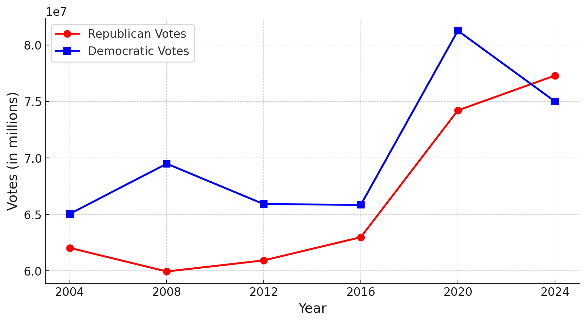
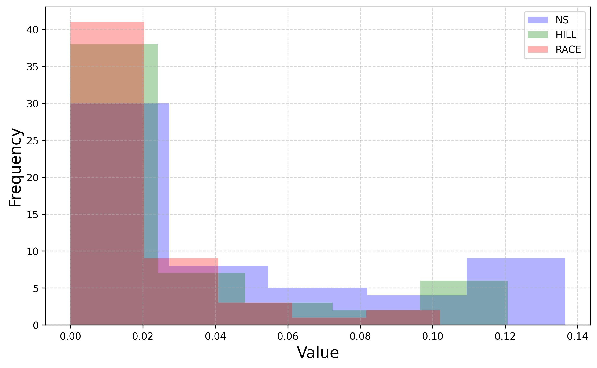
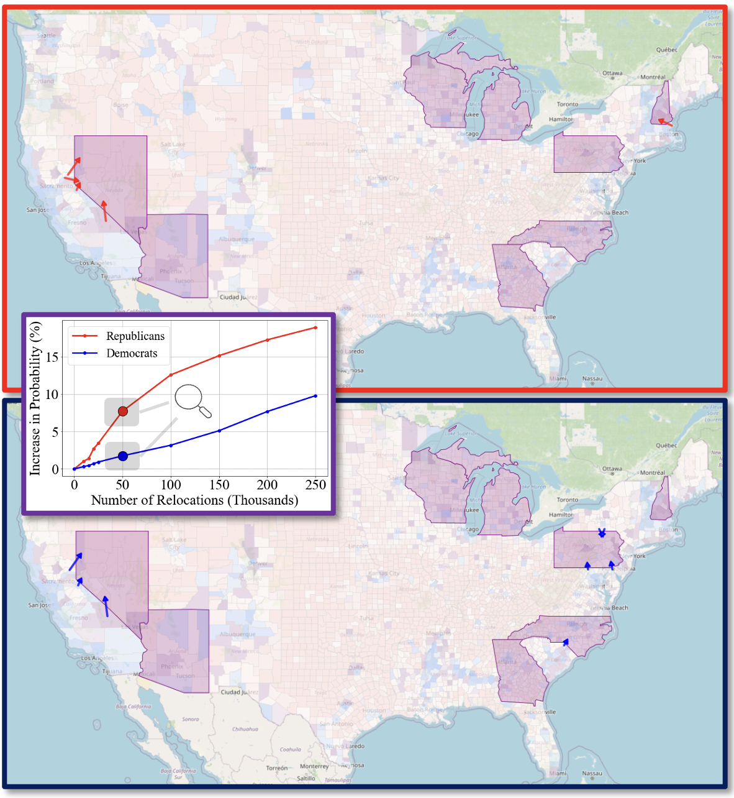

[](https://pubsonline.informs.org/journal/ijoc)


# **The Sensitivity of the U.S. Presidential Election to Coordinated Voter Relocation**


This archive is distributed in association with the [INFORMS Journal on
Computing](https://pubsonline.informs.org/journal/ijoc) under the [MIT License](LICENSE).


The software and data in this repository are a snapshot of the software and data
that were used in the research reported on in the paper 
[The Sensitivity of the U.S. Presidential Election to Coordinated Voter Relocation](https://doi.org/10.1287/ijoc.2024.0990) by Carlos Cardonha, David Bergman, Andre A. Cire, Leonardo Lozano, and Tallys Yunes.


## Cite

To cite the contents of this repository, please cite both the paper and this repo, using their respective DOIs.

https://doi.org/10.1287/ijoc.2024.0990

https://doi.org/10.1287/ijoc.2024.0990.cd

Below is the BibTex for citing this snapshot of the respoitory.

```
@article{CardonhaElections2025,
  title =     {The Sensitivity of the U.S. Presidential Election to Coordinated Voter Relocation},
  author =    {Cardonha, Carlos and Bergman, David and Cire, Andre A. and Lozano, Leonardo and Yunes, Tallys},
  publisher = {INFORMS Journal on Computing},
  year =      {2025},
  doi =       {10.1287/ijoc.2024.0990.cd},
  url =       {https://github.com/INFORMSJoC/2024.0990},
  note =      {Available for download at https://github.com/INFORMSJoC/2024.0990},
}  
```


## **Data**

The raw data used for model fitting and optimization are in the directory [data](data/). This includes:

- [Voter Turnout](data/countypres_2000-2020.csv):
  - Historical voter turnout by country per party
  - [Web Link](https://dataverse.harvard.edu/dataset.xhtml?persistentId=doi%3A10.7910%2FDVN%2FVOQCHQ)
  - [License](https://creativecommons.org/publicdomain/zero/1.0/)

- [County Population](data/cc-est2022-agesex-all.csv):
  - County population with estimates
  - [Web link](https://www.census.gov/data/tables/time-series/demo/popest/2020s-counties-detail.html): 
  - [License](https://www.census.gov/data/software/x13as/disclaimer.html)

- [US City Distances](data/uscities.csv)
  - US city locations and populations
  - [Web link](https://simplemaps.com/data/us-cities)
  - [License](https://creativecommons.org/licenses/by/4.0/)


The raw data is processed to create input into our optimization routines. The data that is used for optimization is as follows:

- [County Distances](data/county_dist.csv): The weighted pairwise county distances.
- [Input Data](data/InputData.csv): The output of the distribution fitting which is used for the optimization routines.

## **Code**

Our statistical analysis, distribution fitting and simulation was implemented in Python and our optimization modeling was implemented in Java.  
- [Distribution Fitting](code/Distribution%20Fitting/): Contains one [Python script](code/Distribution%20Fitting/distribution_fitting_simulation.py) which estimates voter turnout by county by party, and produces simulations of those values.
- [Distance Calculator](code/Distance%20Calculator/): Contains one [Python script](code/Distance Calculator/county_distance_creator.py) which takes city distances and populations, and calulates center of mass and pairwise distances.
- [Optimization Model](code/Optimization%20Model/): Contains The four java files that run the model, with 'main.java' containing the main function.


## **Test Sets**


The instructions are as follows:
- If there’s a license associated with those instances that allows redistribution, please include the license file. 
- If the instances come from a widely accessible instance library (such as MIPLIP), we request that you provide a script to download the files from the official site (or, at the very least, a list of the files). 
- If you are using instances from a small library on an academic's website that has been published for public use, please include a file in the \data directory that describes where and when the instances were obtained from. 


#### Historical data

We trained a voter turnout simulation model that simulates the number of votes received by each candidate in each of the 3,150 counties participating in the 2024 U.S. presidential election using county-level voting returns for the last five elections (2004-2020) with data from the [MIT Election Data Science Lab](https://electionlab.mit.edu/).  


INSTRUCTIONS:``If the instances come from a widely accessible instance library (such as MIPLIP), we request that you provide a script to download the files from the official site (or, at the very least, a list of the files).'' -> I think that's the case, so we can provide direct links to the files we are using, i.e., we don't need to download the data and add it to the repo. 


#### Forecast data

Now this may be an issue, as I don't know if there are licenses associated with these datasets. The data we used is probably not available online, so I guess we may have to add them to the repository. 


-  [Silver bulletin 2024 presidential election forecast](https://www.natesilver.net/p/nate-silver-2024-president-election-polls-model), extracted on 10/9/2024;
- [The Hill's 2024 Election Center](https://elections2024.thehill.com/), extracted on 11/4/2024; and
-  [Race to the WH](https://www.racetothewh.com/), extracted on 11/5/2024.


#### Other data

I think we used other datasets and sources. 


## **Running the Experiments**

The scripts used in the experiments are located in the folder `scripts` and can be replicated through the steps described below.


### Voter Turnout Simulation Model


### Bayesian-style Update Model


### Network Flow Model


The source code with our network flow model is located in the folder `src`.


### Out-of-Sample Evaluation


## **Results**

The folder `results` contains the results of the experiments reported in the paper. Our code was implemented in Java. We ran our experiments on an Intel(R) Xeon(R) CPU E5-1650 v4 at 3.60GHz with 32GB of RAM. We used `CPLEX 20.1` with default settings to solve all the MIPs. We reproduce below the plots presented in the article. 


### Voter Turnout per Party and County

Our Bayesian-style update model relies on recent poll data. Predictions about election outcomes vary across polling services, so we use three sources in this study. 

<!-- 


 

#### Calibrated voter turnout based on Silver Bulletin 


#### Calibrated voter turnout based on The Hill 


#### Calibrated voter turnout based on RTWH 


-->


<div style="text-align:center;">
  
  
  <p><em>Uncalibrated voter turnout</em></p>
</div>


<div style="text-align:center;">
  
  
  <p><em>Calibrated voter turnout based on <a href="https://www.natesilver.net/p/nate-silver-2024-president-election-polls-model">Silver Bulletin</a> (extracted on 10/9/2024).
  </em></p>
</div>


<div style="text-align:center;">
  
  
  <p><em>Calibrated voter turnout based on <a href="https://elections2024.thehill.com/">The Hill</a> (extracted on 11/4/2024).
  </em></p>
</div>


<div style="text-align:center;">
  
  
  <p><em>Calibrated voter turnout based on <a href="https://www.racetothewh.com/">Race to the WH</a> (extracted on 11/5/2024).
  </em></p>
</div>


### Popular vote in the last U.S. presidential elections




### Histogram of Bayesian update factors across polling sites





### Sensibility to Movement Cap

We study the sensitivity of our results to the fraction by which the population of a county may change. We run the modified network flow model for 100,000 movements and parameters $\delta \in \{1, 0.1, 0.05, 0.025, 0.01\}$, using optimization and evaluation sets derived from [Silver Bulletin](results/figures/silver.pdf), [The Hill](results/figures/hill.pdf), and [Race to the WH](results/figures/race.pdf).


### Prescribed Moving Strategy

Movement patterns for 50,000 people for Republicans (top) and Democrats (bottom), and impact of the number of people moved on the probability of winning for different relocation sizes (line plot).



